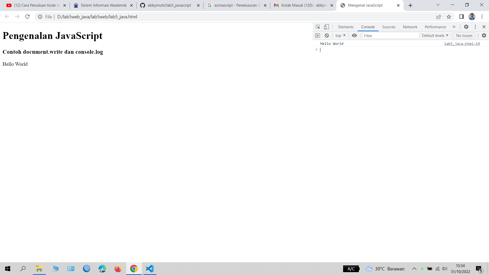

# lab5_javascript
# Nama      : Abby Muhammad Titan
# Nim       : 312110546
# Kelas     : TI.21.B1
# UNIVERSITAS PELITA BANGSA
# Langkah-Langkah Membuat Dokumen HTML dengan tampilan javascript
# Langkah 1
# Proses 1
# Tampilan contoh java script

# Langkah 2
# Proses 2
# Pemakaian alert sebagai property window

# Langkah 3
# Proses 3
# Pemakaian method dalam objek 

# Langkah 4
# Proses 4
# Pemakaian Prompt dan pemasukkan data nama

# Langkah 5
# Proses 5
# Pembuatan fungsi dan cara pemanggilannya atau pemanggilan data onload

# Langkah 6
# Proses 6
# Operasi dasar aritmetika

# Langkah 7
# Proses 7
# Seleksi kondisi if-else

# Langkah 8
# Proses 8
# Membuat form input

# Langkah 9
# Proses 9
# Membuat form button

# Langkah Terakhir adalah membuat HTML DOM Check Box
# ini adalah tampilan nya

# Membuat Form Validator sendiri
# TUGAS
# ini tampilan form nya

# Cukup sekian saya Abby Muhammad Titan
# Terimakasih 
# Assalamualaikum